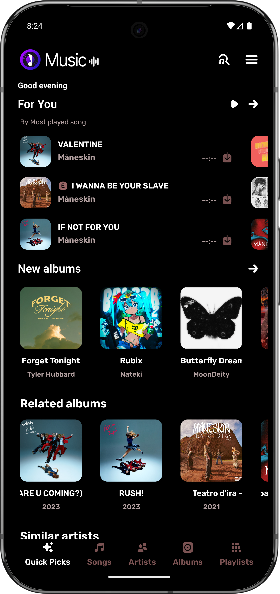
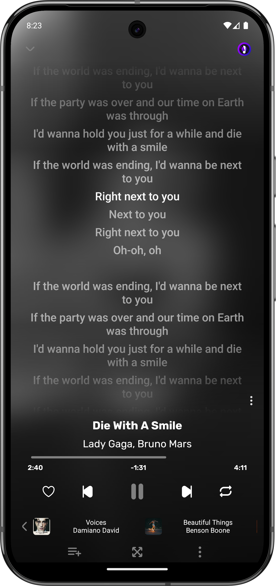
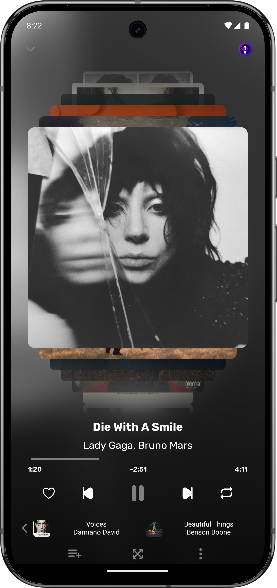
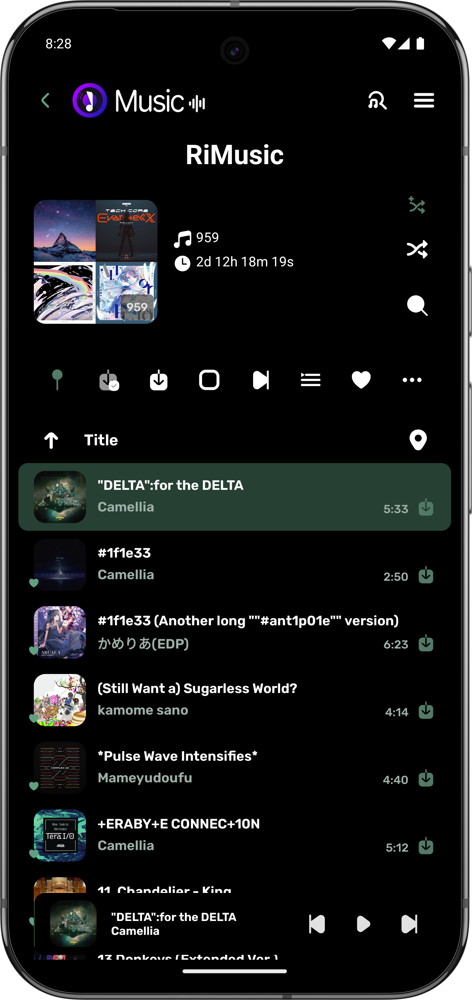
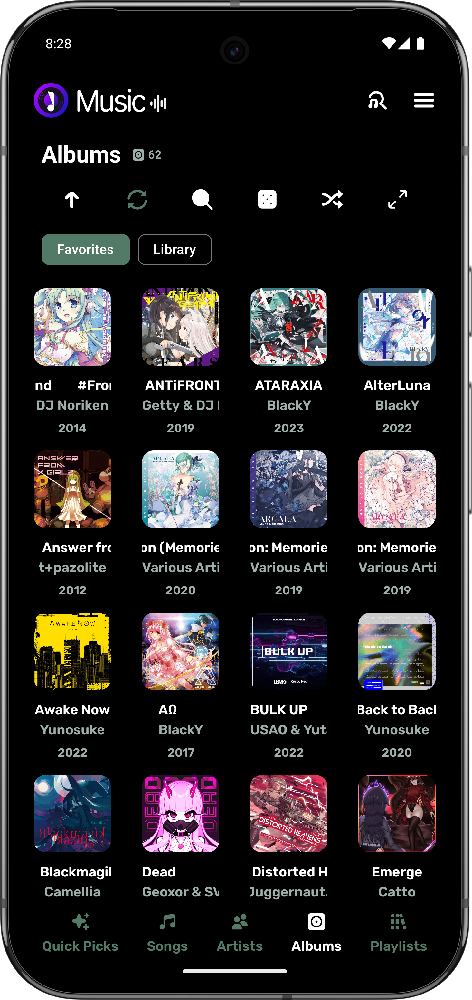
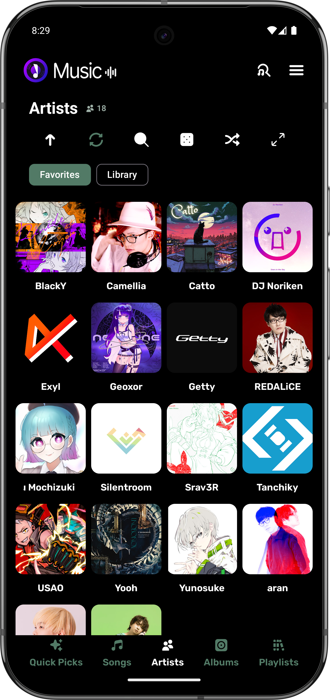
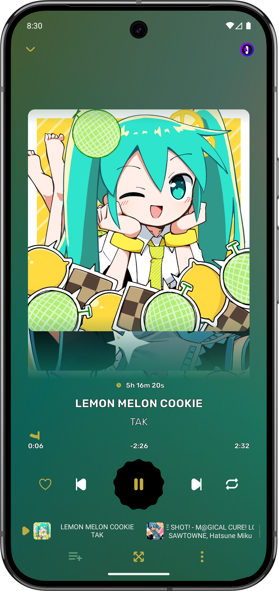

      
  

    <b>Kreate</b> is a <a href="https://github.com/fast4x/RiMusic">RiMusic</a> fork with performance in mind
  

    
   
  
  
  
  

   

  

   

  
  

# 📲 Installation

[](http://apps.obtainium.imranr.dev/redirect.html?r=obtainium://app/%7B%22id%22%3A%22me.knighthat.kreate%22%2C%22url%22%3A%22https%3A%2F%2Fgithub.com%2Fknighthat%2FKreate%22%2C%22author%22%3A%22knighthat%22%2C%22name%22%3A%22Kreate%22%2C%22preferredApkIndex%22%3A0%2C%22additionalSettings%22%3A%22%7B%5C%22includePrereleases%5C%22%3Afalse%2C%5C%22fallbackToOlderReleases%5C%22%3Atrue%2C%5C%22filterReleaseTitlesByRegEx%5C%22%3A%5C%22%5C%22%2C%5C%22filterReleaseNotesByRegEx%5C%22%3A%5C%22%5C%22%2C%5C%22verifyLatestTag%5C%22%3Atrue%2C%5C%22sortMethodChoice%5C%22%3A%5C%22date%5C%22%2C%5C%22useLatestAssetDateAsReleaseDate%5C%22%3Atrue%2C%5C%22releaseTitleAsVersion%5C%22%3Afalse%2C%5C%22trackOnly%5C%22%3Afalse%2C%5C%22versionExtractionRegEx%5C%22%3A%5C%22%5C%22%2C%5C%22matchGroupToUse%5C%22%3A%5C%22%5C%22%2C%5C%22versionDetection%5C%22%3Atrue%2C%5C%22releaseDateAsVersion%5C%22%3Afalse%2C%5C%22useVersionCodeAsOSVersion%5C%22%3Afalse%2C%5C%22apkFilterRegEx%5C%22%3A%5C%22Kreate-release.apk%5C%22%2C%5C%22invertAPKFilter%5C%22%3Afalse%2C%5C%22autoApkFilterByArch%5C%22%3Atrue%2C%5C%22appName%5C%22%3A%5C%22Kreate%5C%22%2C%5C%22appAuthor%5C%22%3A%5C%22Knight%20Hat%5C%22%2C%5C%22shizukuPretendToBeGooglePlay%5C%22%3Afalse%2C%5C%22allowInsecure%5C%22%3Afalse%2C%5C%22exemptFromBackgroundUpdates%5C%22%3Afalse%2C%5C%22skipUpdateNotifications%5C%22%3Afalse%2C%5C%22about%5C%22%3A%5C%22%5C%22%2C%5C%22refreshBeforeDownload%5C%22%3Afalse%7D%22%7D)

# ✨ Features

- **Multilingual:** English, Italian, German, Russian, French, Spanish, Czech, Turkish, Romanian and more. Contributions for other languages are welcome
- Friendly designs
- UI Mode, switch from RiMusic to classic ViMusic style, and vice versa.
- Auto cache songs for offline playback with a custom cache size
- Download songs or entire playlists for offline playback (not cache)
- Background playback
- Listening statistics
- Audio visualizer on player with many type of effects.¹
- News, mood, musical genres, new albums from favourite artists
- Import/Export online, RiMusic playlists, can be shared with friends
- Fetch, display, edit, translate synchronized, or not, songs lyrics
- Customizable themes
- Sleep timer with customizable time
- Audio control: volume app, device, playback speed, pitch, normalization, skip silence
- Support for Android Auto, Android TV, and YouTube video
- Widgets (experimental)
- Check for Updates, which can be enabled or disabled in settings
- Export cached/downloaded media
- Export settings
- Plays music even with no internet connection
- Fully featured in-app update checker and auto-update.²

> [!NOTE]
> **¹** This feature requires **microphone permission** (disabled by default)\
> **²** This feature only available on GitHub builds (`Kreate-release.apk` and `Kreate-uncompressed.apk`)

# Social media

- [Discord](https://discord.gg/WYr9ZgJzpx)

# 📷 Screenshots

    
    
    
    
    
    
    
    
    

# 🌐 Supported languages

> Many thanks to people who also helped in RiMusic.

Chart and contributions are displayed in our [official website](https://kreate.knighthat.me/translators)

    <b>Your language is not listed? [Request one](https://translate.kreate.knighthat.me/project/kreate) now.</b>

# 🤝 Contributing

## To improve functionalities

Contributions are welcome! To develop new features or fix bugs, please fork the repository and open a pull request.

**For more details, please refer to** [the documentation](https://kreate.knighthat.me/dev/getting_started).

## To translate app

To **translate** or **improve a translation**, **fix typo**, or to **request new language**.

## To write documentation

**To help others understand the app, please visit** [knighthat/Kreate-docs](https://github.com/knighthat/Kreate-docs) repository.

## If you are good at designing

UI/UX designers are welcome!  

**Submit your designs by** [opening a ticket](https://github.com/knighthat/Kreate/issues/new?template=feature_request.yaml)

# 🫂 Acknowledgements

| Type                                                          | Authors                                                                                                                                | Notes                                                         |
|---------------------------------------------------------------|----------------------------------------------------------------------------------------------------------------------------------------|---------------------------------------------------------------|
| [RiMusic](https://github.com/fast4x/RiMusic)                  | [fast4x](https://github.com/fast4x)                                                                                                    |                                                               |
| Player design                                                 | [aneesh1122](https://github.com/aneesh1122)                                                                                            |                                                               |
| Icons                                                         | [Ionicons](https://github.com/ionic-team/ionicons), [FlatIcon.com](https://www.flaticon.com/), [jaimtres](https://github.com/jaimtres) | **jaimtres** designed RiMusic's Logo, many current icons      |
| Translators library                                           | [therealbush/translator](https://github.com/therealbush/translator)                                                                    |                                                               |
| Lyrics provider                                               | [KuGou](https://www.kugou.com), [LrcLib](https://lrclib.net)                                                                           |                                                               |
| [HypnoticCanvas](https://github.com/mikepenz/HypnoticCanvas/) | [mikepenz](https://github.com/mikepenz)                                                                                                | A shader modifier for Compose Multiplatform / Jetpack Compose |
| App logo                                                      | [MedieroAF](https://github.com/MedieroAF)                                                                                              | MedieroAF's logo since 1.3.0                                  |
| Badges                                                        | [Shields.IO](https://shields.io/), [dcbadge](https://github.com/gitlimes/dcbadge)                                                      |                                                               |

# 💸 Donation

> Help me keep the project running longer.
> This is completely optional, you don't have to pay to use/unlock any feature.

| Platform  | Address                                                                                         |
|-----------|-------------------------------------------------------------------------------------------------|
| Liberapay | https://liberapay.com/knighthat                                                                 |
| Patreon   | https://patreon.com/knighthat                                                                   |
| Monero    | 44G5dUFTbFWYfZAk69irnDUCTNZzP5viNTmkGpCNCLHjjYQq7jjRTWoYTH1aY8P841hExP31Qxg2hXPtxreKu11zCYdxQUj |
| Bitcoin   | 1GpZUvhdVkCFxqF4vuaiFxtBTxB3L94vnK                                                              |

# ⚠️ Disclaimer

This project is built on top of [RiMusic](https://github.com/fast4x/RiMusic) but has no relation to the original author.
Furthermore, its contents are not affiliated with, funded, authorized, endorsed by, or in any way associated with YouTube,
Google LLC or any of its affiliates, subsidiaries.

Any trademark, service mark, trade name, or other intellectual property rights used in this project are owned by the respective owners.
